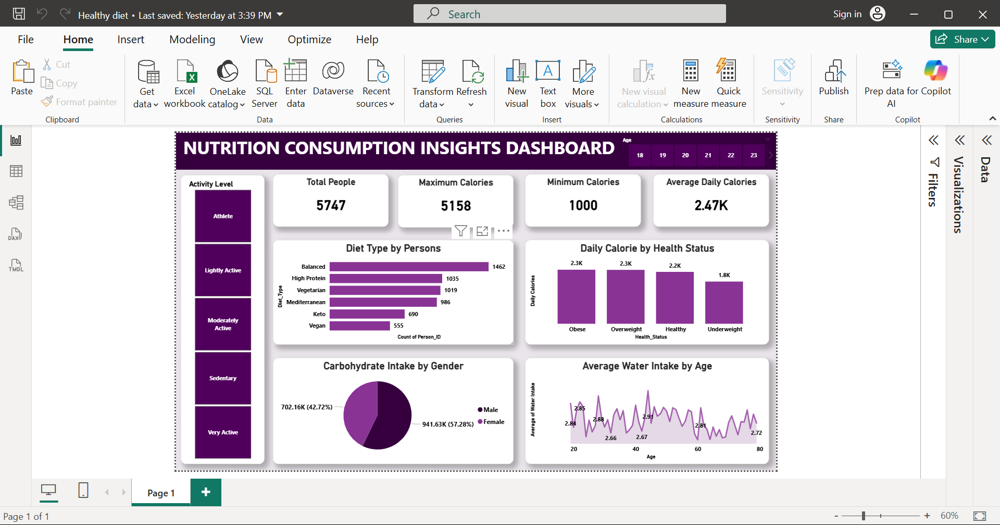

# Task-5-Nutrition-Consumption-Insights-Dashboard-Alaezi-Emmanuel

## 1. Executive Summary
This project provides a comprehensive end-to-end analysis of dietary patterns, caloric intake, hydration habits, and health statuses across 5,747 individuals. Developed entirely in Power BI using Power Query for data transformation and DAX for key calculations.

---

## 2. Key Metrics & Highlights
* **Total Sample Size:** 5,747 individuals
* **Average Daily Calories:** 2.47K kcal
* **Caloric Range:** Minimum 1,000 kcal to Maximum 5,158 kcal
* **Primary Diet Choice:** Balanced Diet (1,462 individuals)

---

## 3. Data Transformation Workflow (Power Query)
* **Data Cleaning:** Processed raw dataset, handled missing values, and standardized diet categories (Balanced, High Protein, Vegetarian, Mediterranean, Keto, Vegan).
* **Demographic Segmentation:** Categorized age distributions and health statuses (Underweight, Healthy, Overweight, Obese).
* **Optimization:** Set explicit data types for fast DAX evaluation and dynamic filtering.

---

## 4. Key Analytical Insights
* **Caloric Intake vs. Health Status:** Average daily caloric intake remains highest across Obese (2.3K) and Overweight (2.3K) groups compared to Underweight (1.8K).
* **Carbohydrate Distribution by Gender:** Females account for 57.28% (941.63K carbs) of total carbohydrate intake, while Males account for 42.72% (702.16K carbs).
* **Hydration Trends:** Average water intake hovers consistently between 2.6L and 2.9L across all age brackets.

---

## 5. Strategic Recommendations
* **Targeted Caloric Awareness:** Implement targeted guidance for segments categorized as Obese and Overweight consuming >2,300 kcal daily.
* **Nutritional Education:** Promote balanced macro ratios tailored by gender demographics.
* **Hydration Consistency:** Encourage consistent fluid intake above 2.5L daily across all age groups.
